<a href="/README.ja.md">日本語版ドキュメントはこちら</a>

# Remotion Music Video Studio (Public)

A music video production environment built with [Remotion](https://www.remotion.dev/).  
**Multiple music videos live side by side in a single repository**, with one video contained entirely in `src/videos/<Name>/`.  
Reusable parts are collected in the shared engine (`src/lib/`) and used by every video.

## Requirements

|         | Version                                   | Notes                                                                        |
| ------- | ----------------------------------------- | ---------------------------------------------------------------------------- |
| Node.js | **22.12 or later** (developed on 22.22.2) | The lower bound comes from Vite. Only the 23.x line is unsupported by Vitest |
| npm     | 10 or later (developed on 10.9.7)         | The version bundled with Node 22 is enough                                   |
| OS      | Windows / macOS / Linux                   | Developed on Windows 11                                                      |

Also:

- **Browser**: rendering needs Chrome Headless Shell. Remotion downloads it automatically on the first render, so no preparation is required (to install it up front, run `npx remotion browser ensure`).
- **FFmpeg**: bundled with Remotion, so there is nothing to install separately.
- **Java** (optional): only needed to redraw [the diagram in this README](#dependency-graph). Not required just to render videos.

## Setup

```console
# install
npm install

# to add skills
npx remotion skills add
```

### Main dependencies

Versions are pinned in `package.json`, so `npm install` gives you the same set (Remotion 4.0.518 / React 19.2.3 / TypeScript 5.9.3).

- `remotion` / `@remotion/cli` / `react` / `react-dom` — the foundation the Remotion template sets up
- `@remotion/google-fonts` / `@remotion/noise` — font loading, and randomness for the wobble
- `vitest` / `jsdom` — tests for pure functions
- `storybook` / `@storybook/react-vite` / `vite` / `@vitejs/plugin-react-swc` — checking `src/lib/` parts in isolation
- `@remotion/player` — the stage that plays back stories

What each package was added for is in [`docs/instructions/setup.md`](./docs/instructions/setup.md).

## Commands

| Command                   | What it does                                                                    |
| ------------------------- | ------------------------------------------------------------------------------- |
| `npm run dev`             | Preview in Remotion Studio                                                      |
| `npm run lint`            | `eslint src tests stories && tsc`. Always run this after changing code          |
| `npm test`                | `vitest run`. Tests for pure functions and sequence math (`tests/**/*.test.ts`) |
| `npm run build`           | `remotion bundle` (writes out the bundle used for rendering)                    |
| `npm run upgrade`         | Update the Remotion-related packages                                            |
| `npm run storybook`       | Check `src/lib/` parts in isolation with Storybook                              |
| `npm run build-storybook` | Export Storybook statically to `storybook-static/`                              |

To export, render by specifying the Composition id:

```console
npx remotion render <Composition id> out/video.mp4
```

## Documentation

The documents below are written in Japanese.

| Document                                                                           | When to read it                                                                                          |
| ---------------------------------------------------------------------------------- | -------------------------------------------------------------------------------------------------------- |
| [`docs/instructions/code_guide.md`](./docs/instructions/code_guide.md)             | When writing code (naming, when to extract constants, where tests go)                                    |
| [`docs/instructions/lib_guide.md`](./docs/instructions/lib_guide.md)               | When using or adding a shared part                                                                       |
| [`docs/instructions/transition_guide.md`](./docs/instructions/transition_guide.md) | When touching how shots are switched                                                                     |
| [`docs/instructions/localization.md`](./docs/instructions/localization.md)         | When adding a language version or fixing the lyrics JSON                                                 |
| [`docs/instructions/new_video.md`](./docs/instructions/new_video.md)               | When adding a new music video                                                                            |
| [`docs/instructions/storybook.md`](./docs/instructions/storybook.md)               | When checking a `src/lib/` part in isolation                                                             |
| [`docs/instructions/setup.md`](./docs/instructions/setup.md)                       | When adding or replacing a dependency                                                                    |
| [`docs/videos/meerkat.md`](./docs/videos/meerkat.md)                               | Timings, numbers and specifics of the included video "きょろきょろミーアキャット / Looky Looky Meerkats" |

## Overall structure

**One music video = one `src/videos/<Name>/` folder**, with its assets kept separately under `public/assets/<Name>/`.  
Folders are split by whether they are "shared (usable by another video)" or "specific to that video", and **dependencies always point one way: video-specific → shared.**

### Dependency graph

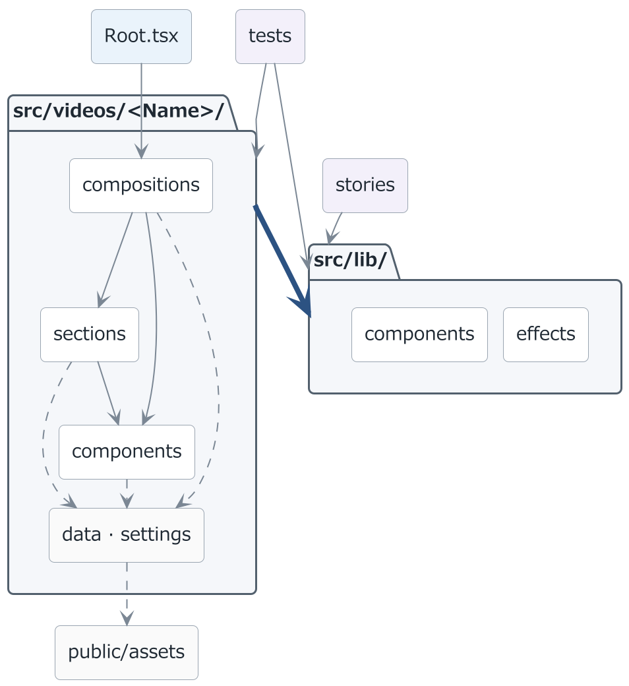

Arrows show the direction of reference. The thick arrows are the rule to keep: **dependencies go one way, video-specific → shared.**  
`src/lib/` never imports from `src/videos/`, and videos never import from each other.

Inside a video there are three layers, top to bottom: **finished pieces (`compositions/`) → shots (`sections/`) → materials (`components/`)**, where an upper layer uses the layer below. Dotted lines are references that only read a value or a path.

Remotion's entry point is `src/index.ts` (`registerRoot`), and **whatever is reachable from there through imports is what gets rendered**.  
`tests/` and `stories/` are verification tools that are not reachable, so they live outside `src/` (`docs/` holds the conventions and the per-video records, and is never referenced from code).

> The source of the diagram is [`docs/readme/uml/architecture.puml`](./docs/readme/uml/architecture.puml).  
> When the structure changes, redraw it with PlantUML:  
> `java -jar <path>/plantuml.jar -charset UTF-8 -tpng -Sdpi=192 -o ".." docs/readme/uml/architecture.puml`

### Folder layout

`<Name>` is the name of one music video. The links point to `meerkat`, the video currently included.

| Path                                               | Contents                                                                                                                                                                        |
| -------------------------------------------------- | ------------------------------------------------------------------------------------------------------------------------------------------------------------------------------- |
| [`src/lib/`](./src/lib)                            | The shared engine used by every video. Visual parts, effects and unit conversions (see "[Shared engine](#shared-engine-srclib)" below)                                          |
| [`src/Root.tsx`](./src/Root.tsx)                   | Registers every video's Compositions, grouped by `<Folder>`                                                                                                                     |
| [`src/videos/<Name>/`](./src/videos/meerkat)       | All the code for one music video: materials, shots, finished pieces, lyrics, settings (see "[Video-specific](#video-specific-srcvideosname)" below)                             |
| [`tests/`](./tests)                                | Tests. Mirrors the shape of `src/` underneath                                                                                                                                   |
| [`stories/`](./stories)                            | Storybook stories (for `src/lib/`). Mirrors the shape of `src/` underneath                                                                                                      |
| [`docs/`](./docs)                                  | Conventions ([`instructions/`](./docs/instructions)), per-video records ([`videos/`](./docs/videos)), and the diagrams and GIFs used in the README ([`readme/`](./docs/readme)) |
| [`public/assets/<Name>/`](./public/assets/meerkat) | Audio (`audio/`), images (`images/`) and movies (`movie/`). Per-language variants go in `audio/<lang>/`, `images/<lang>/`                                                       |

A Composition id looks like `MV-<title>-<length>-<language>`. The title acts as a namespace so ids never collide as videos are added (Remotion only allows alphanumerics, hyphens and CJK in an id, so hyphens are the separator).  
In Studio, `<Folder name="<Name>">` in `src/Root.tsx` groups the Compositions per video.

Relative paths to `src/lib/` are `../../../lib/...` from `sections/` and `compositions/`, and `../../../../lib/...` from the one-level-deeper `components/*/`.  
From `tests/` and `stories/` you are outside `src/`, so the path goes through `src/`, e.g. `../../../../src/lib/...`.

## Video-specific (`src/videos/<Name>/`)

Code used only by that video. Inside there are three layers, **materials (`components/`) → shots (`sections/`) → finished pieces (`compositions/`)**, where an upper layer uses the layer below.

| Folder                                                                 | Contents                                                                                                                                                                   |
| ---------------------------------------------------------------------- | -------------------------------------------------------------------------------------------------------------------------------------------------------------------------- |
| [`index.ts`](./src/videos/meerkat/index.ts)                            | Exports that video's Compositions (`Root.tsx` reads only this file)                                                                                                        |
| [`components/`](./src/videos/meerkat/components)                       | Materials: that video's visual parts. Paired with `src/lib/components/`                                                                                                    |
| [`components/characters/`](./src/videos/meerkat/components/characters) | How the characters look (`CharaBackground` / `CharaDance` / `CharaHover`)                                                                                                  |
| [`components/text/`](./src/videos/meerkat/components/text)             | Wrappers for subtitles and telops (`MeerkatSubtitle` / `MeerkatTelop` / `FullVersionTelop`)                                                                                |
| [`sections/`](./src/videos/meerkat/sections)                           | Shots built out of materials, ordered by the structure of the song (`00_01_Intro.tsx` …)                                                                                   |
| [`compositions/`](./src/videos/meerkat/compositions)                   | Finished pieces made of shots. The Japanese versions (`MusicVideoFull.tsx` / `MusicVideoShort.tsx`) are the real implementation; other languages hold only the differences |
| [`data/subtitle/`](./src/videos/meerkat/data/subtitle)                 | Lyrics data (`<lang>/Lyrics.json` per language)                                                                                                                            |
| [`settings/`](./src/videos/meerkat/settings)                           | That video's colors (`Theme.ts`) and asset paths (`Assets.ts`) — only those referenced from two or more places                                                             |

The materials folder is called `components/` so that it pairs with `src/lib/components/`.  
A wrapper goes in the **subfolder with the same name** as what it wraps (the wrapper for `lib/components/text/Subtitle` lives in `videos/<Name>/components/text/`).

```
src/lib/components/            background/  cuts/  transition/  text/
src/videos/<Name>/components/               characters/         text/
```

To lock in a look that belongs to one video, make a thin wrapper on the video side and pass it to the shared part (`CharaBackground` → `SimpleBackground`, `MeerkatSubtitle` → `Subtitle`).

## Shared engine (`src/lib/`)

The parts shared by every video. They **know nothing about the song, the characters or the title**, so everything specific is passed in as Props.  
Image and audio paths are the only ones with no default value (assets are split under `assets/<Name>/...`, so they are required Props).

| Folder                                                      | Contents                                                                           |
| ----------------------------------------------------------- | ---------------------------------------------------------------------------------- |
| [`components/`](./src/lib/components)                       | Visual parts that can be dropped in on their own                                   |
| [`components/transition/`](./src/lib/components/transition) | Switching shots (the effect at the seam, and how a sequence is joined)             |
| [`effects/`](./src/lib/effects)                             | Helpers for visuals and audio (ones that return a value / ones that wrap children) |
| [`units/`](./src/lib/units)                                 | Converting between beats, seconds, frames and screen ratios                        |

### `components/` — visual parts that can be dropped in on their own

Place them directly inside a `<Sequence>` or an `AbsoluteFill`. They are split into four subfolders by role ([`background/`](./src/lib/components/background) / [`cuts/`](./src/lib/components/cuts) / [`transition/`](./src/lib/components/transition) / [`text/`](./src/lib/components/text)).

<table>
<tr>
  <td width="33%" valign="top">
    <br>
    <a href="./src/lib/components/background/SimpleBackground.tsx"><code>SimpleBackground</code></a><br>Slowly turning ornaments on a flat fill
  </td>
  <td width="33%" valign="top">
    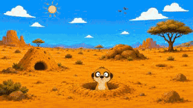<br>
    <a href="./src/lib/components/cuts/ImageCuts.tsx"><code>ImageCuts</code></a><br>Shows still images in order
  </td>
  <td width="33%" valign="top">
    <br>
    <a href="./src/lib/components/cuts/MovieCut.tsx"><code>MovieCut</code></a><br>Plays a movie as one cut
  </td>
</tr>
<tr>
  <td width="33%" valign="top">
    <br>
    <a href="./src/lib/components/cuts/FrameAnimation.tsx"><code>FrameAnimation</code></a><br>Swaps frames at a set interval
  </td>
  <td width="33%" valign="top">
    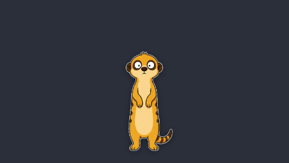<br>
    <a href="./src/lib/components/cuts/FrameAnimation.tsx"><code>CutoutStage</code></a><br>One cutout, anchored at its feet
  </td>
  <td width="33%" valign="top">
    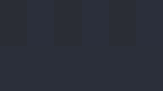<br>
    <a href="./src/lib/components/text/Subtitle.tsx"><code>Subtitle</code></a><br>Karaoke-fill lyrics, advancing by line
  </td>
</tr>
<tr>
  <td width="33%" valign="top">
    <br>
    <a href="./src/lib/components/text/Telop.tsx"><code>Telop</code></a><br>Short on-screen text (outline, shadow)
  </td>
  <td width="33%"></td>
  <td width="33%"></td>
</tr>
</table>

One of them never appears on screen. [`TextStyle`](./src/lib/components/text/TextStyle.ts) (not a component) holds the font and outline shared by subtitles and telops, and runs `loadFont()` on import.

The basic shape of a section is "declare the sequence of cuts and the effects at their seams, then hand it to `ImageCuts`":

```tsx
// startSec alone determines each cut's length (it lasts until the next cut starts)
const CUTS: ImageCut[] = [
  {
    src: "assets/<Name>/images/Art_10.png",
    startSec: 0,
    motion: { from: { scale: 1 }, to: { scale: 1.05 } },
  },
  {
    src: "assets/<Name>/images/Art_11.png",
    startSec: 3.2,
    // The effect at a seam is written on the cut that is coming in
    transitionIn: { kinds: [TRANSITION_KINDS.FADE], durationSec: 0.6 },
    motion: { from: { scale: 1.1 }, to: { scale: 1.05 } },
  },
];

export const Solo = () => (
  // What is underneath shows through during a fade, so lay down a background color
  <AbsoluteFill style={{ backgroundColor: FADE_BASE_COLOR }}>
    <ImageCuts cuts={CUTS} />
  </AbsoluteFill>
);
```

### Transitions — switching shots

**There is exactly one engine that joins a sequence, [`TransitionRun`](./src/lib/components/transition/TransitionRun.tsx)**, and both a sequence of sections and a sequence of cuts go through it ([`ImageCuts`](./src/lib/components/cuts/ImageCuts.tsx) is a thin layer that just repacks `ImageCut[]` into `TransitionRun` items).  
Do not use [`TransitionLayer`](./src/lib/components/transition/Transition.tsx) directly when building a sequence.

<table>
<tr>
  <td width="33%" valign="top">
    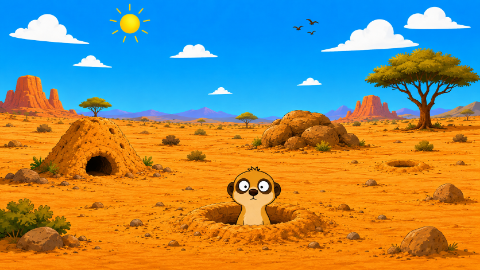<br>
    <code>NONE</code><br>No effect
  </td>
  <td width="33%" valign="top">
    <br>
    <code>FADE</code><br>Dissolves through brightness
  </td>
  <td width="33%" valign="top">
    <br>
    <code>BLUR</code><br>Blurs
  </td>
</tr>
<tr>
  <td width="33%" valign="top">
    <br>
    <code>SLIDE_LEFT</code><br>Slides to the left
  </td>
  <td width="33%" valign="top">
    <br>
    <code>SLIDE_RIGHT</code><br>Slides to the right
  </td>
  <td width="33%" valign="top">
    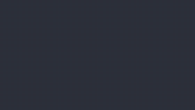<br>
    <code>SLIDE_UP</code><br>Slides upward
  </td>
</tr>
<tr>
  <td width="33%" valign="top">
    <br>
    <code>SLIDE_DOWN</code><br>Slides downward
  </td>
  <td width="33%" valign="top">
    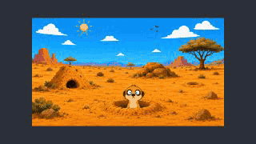<br>
    <code>ZOOM_IN</code><br>Switches while pushing in
  </td>
  <td width="33%" valign="top">
    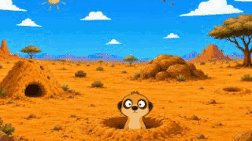<br>
    <code>ZOOM_OUT</code><br>Switches while pulling back
  </td>
</tr>
<tr>
  <td width="33%" valign="top">
    <br>
    <code>FADE + SLIDE_LEFT</code><br>Stacked (dissolves while sliding left)
  </td>
  <td width="33%" valign="top">
    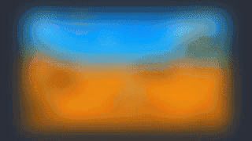<br>
    <code>BLUR + ZOOM_IN</code><br>Stacked (pushes in while blurring)
  </td>
  <td width="33%"></td>
</tr>
</table>

The tuning values (when omitted) are `blurPx` (30) for `BLUR`, `slideRatio` (1 = one full screen) for `SLIDE_*`, and `zoomAmount` (0.25) for `ZOOM_*`. The kinds are defined in [`Transition.tsx`](./src/lib/components/transition/Transition.tsx).

<table>
<tr>
  <td width="33%" valign="top">
    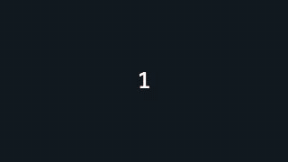<br>
    <code>CROSS_DISSOLVE</code><br>Both sides fade (composited in sRGB)
  </td>
  <td width="33%" valign="top">
    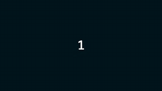<br>
    <code>LINEAR_OVER_UNDER</code><br>Only the incoming side fades (composited in linear space)
  </td>
  <td width="33%"></td>
</tr>
</table>

**`transitionIn` describes "how that item comes in" = the seam _before_ that item.**  
N items have N-1 seams, so write it on `items[1]` and later (leave it out for a hard cut):

```tsx
<TransitionRun
  items={[
    { name: "A", startSec: 0, element: <A /> }, // first item: nothing to come in from
    {
      name: "B",
      startSec: 2,
      // The seam between A and B. durationSec is also "how much the two overlap"
      transitionIn: { kinds: [TRANSITION_KINDS.FADE], durationSec: 0.6 },
      element: <B />,
    },
    {
      name: "C",
      startSec: 4.5,
      // The seam between B and C (it may use a different effect)
      transitionIn: { kinds: [TRANSITION_KINDS.SLIDE_LEFT], durationSec: 0.4 },
      element: <C />,
    },
  ]}
  endSec={endSec}
  blend={TRANSITION_BLENDS.CROSS_DISSOLVE}
/>
```

Use `ImageCuts` for a sequence of still images, and `TransitionRun` directly for everything else (sequences of sections, characters, movies, and so on).  
With Storybook (`npm run storybook`) you can try out `slideRatio` and `blurPx` while watching the result.

### `effects/` — ones that return a value / ones that wrap children

They split into two by how they are called. **When adding a new effect, put it in one of the two.**

#### Ones that return a value ([`functions/`](./src/lib/effects/functions))

`foo(required args..., options?)`. They are pure functions, so they **can also be called from outside a render**, such as in `<Html5Audio volume={(frame) => ...}>` (the frame comes in as an argument).

<table>
<tr>
  <td width="33%" valign="top">
    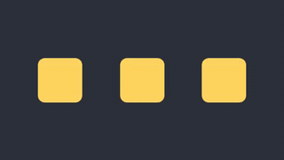<br>
    <a href="./src/lib/effects/functions/LoopMotionEffect.ts"><code>loopMotionEffect</code></a><br>Sine wave behind sway, bounce and spin
  </td>
  <td width="33%" valign="top">
    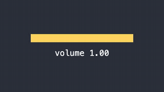<br>
    <a href="./src/lib/effects/functions/AudioFadeEffect.ts"><code>fadeOutVolume</code></a><br>Volume that fades out at the end
  </td>
  <td width="33%" valign="top">
    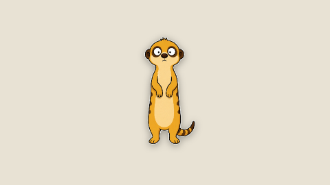<br>
    <a href="./src/lib/effects/functions/DropShadowEffect.ts"><code>dropShadowEffect</code></a><br>Drop shadow along a cutout's outline
  </td>
</tr>
<tr>
  <td width="33%" valign="top">
    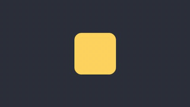<br>
    <a href="./src/lib/effects/functions/BounceEffect.ts"><code>bounceEffect</code></a><br>One bounce, back to where it started
  </td>
  <td width="33%" valign="top">
    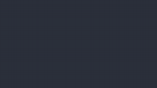<br>
    <a href="./src/lib/effects/functions/PopInEffect.ts"><code>usePopIn</code></a><br>Progress of a springy pop-in entrance
  </td>
  <td width="33%" valign="top">
    <br>
    <a href="./src/lib/effects/functions/ShakeEffect.ts"><code>useShake</code></a><br>Big at the start, settling fast
  </td>
</tr>
</table>

#### Ones that wrap children ([`wrappers/`](./src/lib/effects/wrappers))

`<XxxEffect>{children}</XxxEffect>`. Things that cannot be expressed as a value (redrawing past frames, the `<defs>` of an SVG filter) belong here.

<table>
<tr>
  <td width="33%" valign="top">
    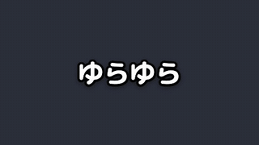<br>
    <a href="./src/lib/effects/wrappers/WiggleEffect.tsx"><code>WiggleEffect</code></a><br>Rotates, shifts and stretches in place
  </td>
  <td width="33%" valign="top">
    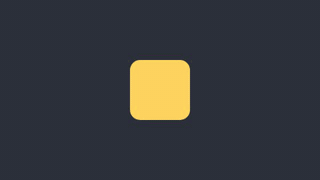<br>
    <a href="./src/lib/effects/wrappers/MotionBlurEffect.tsx"><code>MotionBlurEffect</code></a><br>Layers faint past frames into a trail
  </td>
  <td width="33%" valign="top">
    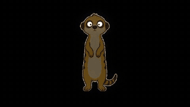<br>
    <a href="./src/lib/effects/wrappers/NightGlowEffect.tsx"><code>NightGlowEffect</code></a><br>Darkened, with only bright parts glowing
  </td>
</tr>
<tr>
  <td width="33%" valign="top">
    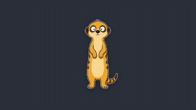<br>
    <a href="./src/lib/effects/wrappers/FloatEffect.tsx"><code>FloatEffect</code></a><br>Drifts up and down, tilting side to side
  </td>
  <td width="33%" valign="top">
    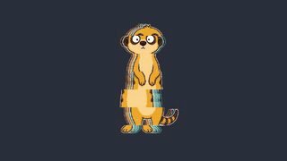<br>
    <a href="./src/lib/effects/wrappers/GlitchEffect.tsx"><code>GlitchEffect</code></a><br>Offsets bands, offsets colors
  </td>
  <td width="33%"></td>
</tr>
</table>

```tsx
// Returns a value: called from inside a callback (fine, because it calls no hooks)
<Html5Audio
  src={staticFile(audioSrc)}
  volume={(frame) => fadeOutVolume(frame, audioFrames, fadeOutFrames)}
/>;

// Returns a value: inside a render, use the thin hook. It returns only "the value at this frame"
const enter = usePopIn();
<AbsoluteFill style={{ opacity: enter }}>…</AbsoluteFill>;

// Wraps children: wraps them as they are. Position and size are passed via style
<WiggleEffect rotateDeg={1.5} rotateSec={2.4} style={{ maxWidth: "70%" }}>
  <MeerkatTelop text={text} fontSize={fontSize} />
</WiggleEffect>;
```

Every bundle of tuning values is exported as `<Name>Options` (`DropShadowOptions`, `MotionBlurOptions`, …), so it can be passed straight from the data for a cut or a character, e.g. `shadow={{ alpha: 0.2 }}`.

> To re-capture the images, render from the dedicated capture entry point ([`docs/readme/capture/`](./docs/readme/capture)) by specifying the Composition id (the same for [`components/`](./docs/readme/components), [`transition/`](./docs/readme/transition) and [`effects/`](./docs/readme/effects)).  
> GIFs are 320x180 at 15fps — 10fps (`--every-nth-frame=3`) only for the transitions, of which there are many — and stills are 480x270 via `remotion still`.  
> Rebuilding the palette with ffmpeg afterwards makes them about 30% smaller (write to another name, then replace):
>
> ```console
> npx remotion render docs/readme/capture/index.ts <id> docs/readme/<kind>/<id>.gif --codec=gif --every-nth-frame=2 --scale=0.5
> npx remotion ffmpeg -i docs/readme/<kind>/<id>.gif -filter_complex "split[a][b];[a]palettegen=max_colors=64:stats_mode=diff[p];[b][p]paletteuse=dither=bayer:bayer_scale=4:diff_mode=rectangle" -loop 0 <temp file>.gif
> ```

### `units/` — converting between beats, seconds, frames and screen ratios

```tsx
const toFrame = useSecToFrame();
// The length of a span is "round both ends, then take the difference"
// (rounding the length first accumulates error and leaves gaps or overlaps between sections)
const from = toFrame(section.startSec);
const durationInFrames = toFrame(endSec) - from + overlapFrames;

// Reinterpret a screen-height-based ratio against the short side
// (guards against overflow in vertical videos; it is 1 for horizontal ones)
const fontSize = height * SUBTITLE_FONT_SIZE_RATIO * useShortSideScale();
```

---

For each part's Props, what the caller is responsible for, the conventions and more examples, see [`docs/instructions/lib_guide.md`](./docs/instructions/lib_guide.md); for the details of switching shots, see [`docs/instructions/transition_guide.md`](./docs/instructions/transition_guide.md).
